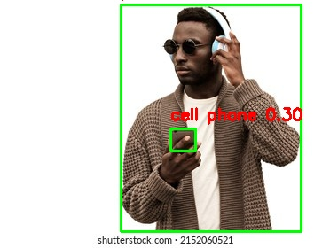
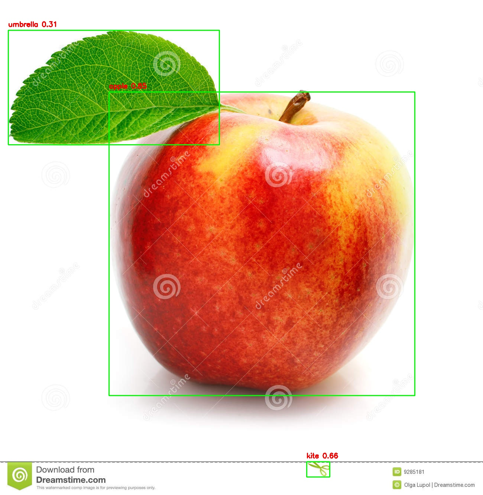
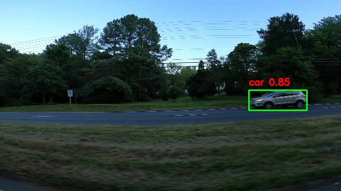

# YOLOv8 Object Detection App

This is a simple object detection web app built with **YOLOv8** and **Streamlit**.  
You can upload images, videos, or use your webcam to detect objects in real time.

---

## Features

-  Detect objects in images and videos
-  Use webcam for live detection
-  Download processed images and videos
-  Choose which classes to show in results

---
##  Demo Results

###  Image Detection Examples






##  Requirements

Install dependencies with:

```bash
pip install -r requirements.txt
